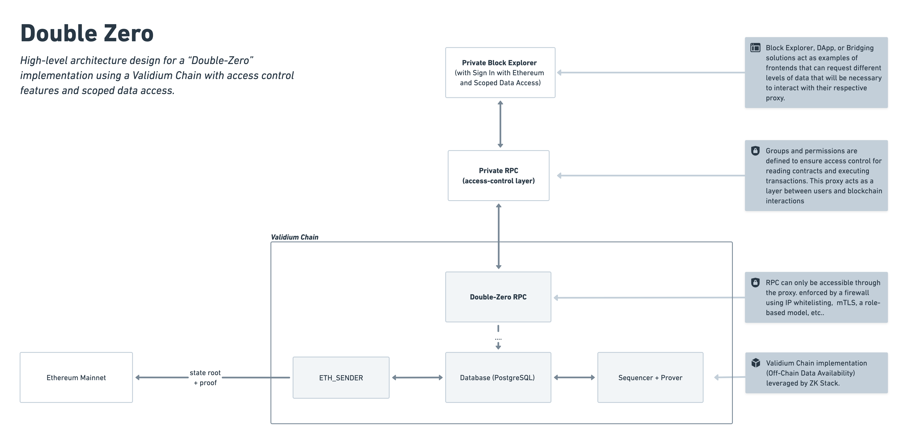

<h3 align="center"> ⛓️ 🔐 👀</h3>
<h1 align="center">Double Zero </h1>

A private blockchain solution with access control features that leverage the ZKsync Elastic Chain ecosystem's development tools and interoperability.

>[!NOTE]
> By combining ***Zero-Knowledge with Zero-Access***, it offers a unique value proposition for organizations seeking to maintain ***privacy and access management** while harnessing the benefits of EVM-compatible technologies.

## ⚖️ Balancing Privacy and Interoperability

Organizations adopting blockchain technology often face a significant dilemma between **the need for privacy and control and the desire for interoperability**.

Banks, financial institutions, and corporations require **strict privacy and access management** over their transactions and data to comply with regulatory standards, protect sensitive information, and maintain competitive advantages. Public blockchains like Ethereum are inherently transparent, making them unsuitable for applications that demand confidentiality.

Simultaneously, these organizations want to leverage i**nteroperability** with existing blockchain networks, **assets** available on public chains, and **Development tools** and robust ecosystems provided by ZKsync or Ethereum. This includes bridging assets, utilizing existing smart contracts and decentralized applications, and benefiting from an active developer community.

### It's a challenge to achieve both

There is a lack of blockchain solutions that offer both. Existing options often force organizations to choose between:

- **Private Blockchains**: Offer necessary privacy and access control but are isolated, lacking interoperability with public networks. This limits asset liquidity and the ability to leverage existing tools and dApps.
- **Public Blockchains**: Provide interoperability and access to a wide range of assets and tools but do not offer the privacy and granular access control required by organizations handling sensitive data.

> [!CAUTION]
> **This trade-off creates a barrier** for organizations that need a **hybrid solution** combining the benefits of both private and public blockchains.

# 💡 Double Zero Solution

Double Zero addresses the need for **both privacy and interoperability**, offering organizations the best of both worlds: **the ability to operate within a secure, private, and controlled** blockchain environment while still **leveraging the tools of the broader Ethereum/Elastic-Chain ecosystem**.

Deploying private Validium chains with **zero-knowledge proofs** ensures transaction data confidentiality and chain security. Implementing **zero-access** through authorization and permission management layers enables granular control over data access and smart contract interactions.

> [!IMPORTANT]
> Offering a near-turnkey solution via **ZK Stack technology** simplifies the process of setting up the Validium chain, customizing features to meet specific needs, and reducing technical barriers and deployment time. Maintaining a connection to the Elastic-Chain/Ethereum settlement layer enables organizations to **bridge assets**, re-utilize **public smart contracts and dApps**, and leverage existing **development tools** and **resources**.

## ⚙️ Components

Double Zero consists of three main components. Below, we'll cover the rationale behind these choices and their implications:

1. [**Validium Chain**](#why-validium)
2. [**Permission-Based Proxy (Private RPC)**](#proxy-implementation-for-validium-rpc)
3. [**Private Block Explorer**](#private-block-explorer)  

## ⛓️ Why Validium?

Selecting the appropriate Layer 2 solution is **crucial for achieving our goals of privacy, scalability, control, customizability, and interoperability**. Validium is a strategic choice that empowers entities like banks, financial institutions, and corporations to harness blockchain technology effectively without compromising security or functionality.

### 1. Privacy Aspects

Validium enhances privacy by storing transaction data off-chain, ensuring sensitive information remains confidential and inaccessible to unauthorized parties. **Organizations have full control over data access**, aligning with Double Zero's Zero-Access principle.

On Ethereum, only minimal data is posted—specifically, cryptographic commitments like state roots and zero-knowledge proofs. **These proofs validate off-chain transactions' correctness without revealing transaction details**, maintaining privacy while ensuring security. 

Since transaction data isn't stored on-chain, **it's impossible to reconstruct the Validium chain's transaction history from L1 data alone**, further enhancing privacy and protecting sensitive information.

### 2. Scalability

Validium excels in scalability by processing thousands of transactions per second, far surpassing Layer 1 and many Layer 2 solutions. By **storing data off-chain**, Validium reduces the computational and storage burden on the Ethereum network, **leading to faster transaction processing and confirmation times**. This approach also **lowers gas costs, making transactions more cost-effective.** 

The efficient resource utilization allows the network to scale seamlessly without compromising performance, making it ideal for enterprise-grade applications that demand high throughput.

### 3. Sequencer/Prover Control

A crucial aspect of Validium is the control it grants over the sequencer and prover components. Organizations can operate their own sequencers and provers, **giving them full control over transaction ordering and proof generation.**

This operational autonomy allows for customized consensus mechanisms and security models tailored to specific organizational requirements. By reducing reliance on external parties, organizations enhance security and minimize trust assumptions—a critical factor for applications handling sensitive or proprietary data.

### 4. Customizability

Validium chains deployed using ZK Stacl offer extensive customizability. Network parameters such as block times, gas limits, and fee structures can be adjusted to optimize performance and user experience. 

### 5. Interoperability with Ethereum

Interoperability is a significant advantage of the Validium chain, as it enables seamless integration with the Ethereum ecosystem. Organizations can bridge assets between the Validium chain and Ethereum, tapping into Ethereum's liquidity and its extensive array of decentralized applications.

Developers benefit from using familiar Ethereum tools and frameworks, which reduces the learning curve and accelerates development timelines.

>[!TIP]
>For more information on Validium configurations please visit: [ZK Stack Validium Chain docs.](https://docs.zksync.io/zk-stack/running-a-zk-chain/validium)

## 🔐 Proxy Implementation for Validium RPC

Implementing a proxy layer on top of the Validium RPC interface is a strategic decision to enhance security, access control, and usability. Given that our audience includes individuals familiar with traditional web2 technologies, we have designed the proxy to be configurable via a `YAML file`.

### Why the Proxy is Necessary

1. **Enforcing Zero-Access Principles:** The proxy acts as a gatekeeper, enforcing strict access controls in line with the Zero-Access principle of Double Zero. It ensures that only authenticated and authorized users can interact with the Validium chain.
2. **Authentication and Authorization:** Direct exposure of the Validium RPC can pose security risks. A proxy allows for the implementation of robust authentication and authorization mechanisms to verify user identities and permissions before granting access. The proxy mitigates security threats by filtering and validating incoming requests.

### YAML-Based Permission Configuration

To cater to a web2 audience and simplify the permission management process, we utilize a `YAML file` to define access controls

Addresses are organized into groups, each associated with specific access rights:

- **Groups:** Logical collections of users/addresses that share the same permissions
- **Permissions:** Define what contracts or methods a group can access.

You can find an example of this configuration at [example-permissions.yaml](./packages/private-rpc/example-permissions.yaml) file used for one of our demos.

## 👀 Private Block Explorer

**Double Zero** Block Explorer is a customized version of the [ZKsync Era Block Explorer](https://github.com/matter-labs/block-explorer) that introduces a layer of privacy and access control. 

By implementing user **authentication and permission-based data restrictions**, it ensures that users can access blockchain data according to their assigned permissions.

> [!TIP]
> For more details on this implementation, please refer to the [README-blockExplorer](./README.md) file.

## 🎯 **Conclusion**

**Double Zero** offers a robust framework that bridges the gap between **privacy** and **interoperability** in blockchain technology. 

This hybrid approach ensures:

- **Privacy**: Confidential data remains protected through off-chain storage and granular access control.
- **Interoperability**: Seamless integration with the broader Ethereum and ZKsync ecosystems, enabling access to existing assets, dApps, and tools.
- **Scalability**: High throughput and cost-efficiency, ideal for enterprise-grade applications.
- **Ease of Use**: Turnkey deployment and familiar tools ensure minimal technical barriers for adoption.

By leveraging the power of **Validium chains**, **zero-knowledge proofs**, and **zero-access principles**, it delivers a secure, scalable, and customizable platform tailored to meet the demands of organizations like banks, financial institutions, and corporations seeking to maintain privacy and access management while harnessing the benefits of blockchain technology.