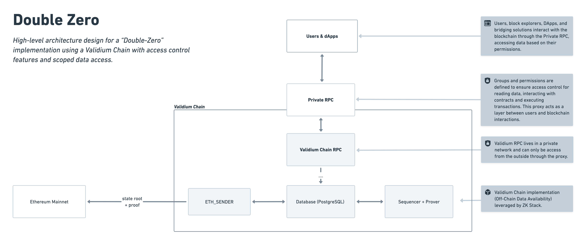

<h3 align="center"> ⛓️ 🔐 👀</h3>
<h1 align="center">Double Zero </h1>

A private blockchain solution with access control features that leverage the ZKsync Elastic Chain ecosystem's development tools and interoperability.

*High-level architecture design for a “Double-Zero” implementation using a Validium
Chain with access control features and scoped data access.*

> [!NOTE]
> By combining ***Zero-Knowledge with Zero-Access***, it offers a unique value proposition for organizations seeking to
> maintain ***privacy and access management*** while harnessing the benefits of EVM-compatible technologies.

## ⚖️ Addressing Privacy vs. Interoperability

Organizations face a recurring challenge: balancing the need for secure, controlled systems with the advantages of
public blockchain integration.

- **Private and Controlled Systems**: Banks, exchanges and brokers among others require controlled environments for
  sensitive operations, ensuring compliance with regulations and safeguarding competitive assets.
- **Open Ecosystems**: Public networks like Ethereum and ZKsync provide rich development tools, liquidity, and access to
  decentralized applications. However, their transparency often conflicts with privacy requirements.

> [!CAUTION]
> **This trade-off creates a barrier** for organizations that need a **hybrid solution** combining the benefits of both
> private and controlled systems in the public blockchain ecosystem.

## 💡 The Double Zero Framework

**Double Zero** empowers organizations to operate within private blockchain environments while seamlessly connecting to
public networks. This is achieved through:

- **Validium Chains**: Ensures confidentiality by keeping sensitive data off-chain while leveraging zero-knowledge
  proofs for verification.
- **Authorization Layers**: Implements granular control over user and transaction permissions.
- **Turnkey Deployment**: Simplifies setup with ZK Stack technology, enabling fast integration and customizations.

With this approach, organizations maintain control over their data and processes while accessing Ethereum-compatible
tools and decentralized applications.

## 🚀 Example Use Cases

### 1. **KYC-Required Actions**

- **Problem**: Ensuring compliance with KYC regulations for accessing blockchain-based services.
- **Solution**: Implement Zero-Access principles to restrict blockchain interactions to KYC-verified users.
- **Example**: A bank allows only verified clients to perform transactions, blocking access for non-clients.

### 2. **Permissioned Asset Management**

- **Problem**: Preventing users from interacting with unapproved assets, such as those restricted due to regional
  compliance.
- **Solution**: Use YAML-configured permissions to limit access to specific tokens or contract methods.
- **Example**: An exchange enables trading only for whitelisted tokens based on the user's region or group, ensuring
  regulatory compliance.

### 3. **Privacy-Preserved Account Management**

- **Problem**: Avoiding data breaches by restricting access to other users' balances or transaction histories.
- **Solution**: Deploy a private block explorer to allow users to view only their own account data.
- **Example**: A broker ensures clients can securely access their balances and transaction details without exposing
  other users' trade information.

## ⚙️ Components

Double Zero consists of three main components. Below, we'll cover the rationale behind these choices and their
implications:

1. [**Validium Chain**](#️-why-validium)
2. [**Permission-Based Proxy (Private RPC)**](#-proxy-implementation-for-validium-rpc)
3. [**Private Block Explorer**](#-private-block-explorer)

## ⛓️ Why Validium?

Validium provides the ideal foundation for Double Zero by addressing key enterprise needs: security, scalability, and
interoperability. Here's why it stands out:

### 1. **Privacy**

- Transaction data remains off-chain, ensuring confidentiality and protecting sensitive information.
- Only cryptographic commitments (state roots and proofs) are stored on-chain, validating transactions without exposing
  details.
- This architecture prevents transaction history reconstruction from on-chain data, further safeguarding privacy.

### 2. **Scalability**

- Processes thousands of transactions per second, far exceeding Layer 1 and many Layer 2 solutions.
- Off-chain data storage reduces computational and storage demands on Ethereum, enabling:
    - Faster processing.
    - Lower gas fees.
- Designed for enterprise-grade applications requiring high throughput and cost efficiency.

### 3. **Control**

- Organizations can operate their own sequencers and provers, maintaining full control over:
    - Transaction ordering.
    - Proof generation.
- Customizable consensus and security models adapt to specific operational needs, reducing reliance on external parties.

### 4. **Customizability**

- Flexible configurations allow organizations to optimize performance:
    - Adjustable block times.
    - Tailored gas limits and fee structures.
    - Specialized operational rules.

### 5. **Interoperability**

- Seamlessly integrates with Ethereum and the ZKsync ecosystem.
- Bridges assets between private Validium chains and public networks, leveraging Ethereum's liquidity and rich dApp
  ecosystem.
- Developers can utilize familiar tools, accelerating adoption and reducing the learning curve.

By combining off-chain privacy, high transaction throughput, and seamless integration with public networks, Validium
chain configuration empowers organizations to deploy secure, scalable, and interoperable blockchain solutions tailored
to their unique requirements.

> [!TIP]
> For more information on Validium configurations please
> visit: [ZK Stack Validium Chain docs.](https://docs.zksync.io/zk-stack/running-a-zk-chain/validium)

## 🔐 Proxy Implementation for Validium RPC

The proxy layer enhances security, streamlines access control, and improves usability when interacting with the Validium RPC interface. Designed with simplicity and versatility in mind, the proxy is configurable via a user-friendly `YAML file`, catering to both technical and non-technical audiences.

### Key Benefits of the Proxy

1. **Enforcing Zero-Access Principles**: Acts as a gatekeeper, ensuring only authenticated and authorized users can interact with the Validium chain, in line with Double Zero's access control philosophy.
2. **Enhanced Security**: Protects the Validium RPC interface by filtering and validating all incoming requests. This minimizes exposure to potential security risks, such as unauthorized access or malicious actions.
3. **Streamlined Authentication and Authorization**: Integrates robust mechanisms to verify user identities and permissions before granting access, ensuring strict adherence to organizational policies.

### YAML-Based Permission Configuration

Double Zero is a **flexible framework**, allowing permission management to be tailored to specific organizational needs. The example implementation below showcases one approach, but it can be easily modified to accommodate unique workflows or compliance requirements.

Permissions are defined in a `YAML file` to simplify configuration and enhance accessibility, especially for web2-oriented teams:

- **Groups**: Logical collections of users or addresses sharing the same permissions.
- **Permissions**: Specific contracts or methods that a group is allowed to access.

This flexibility ensures Double Zero can adapt to various industries and use cases, from financial institutions to decentralized platforms.

You can explore an example configuration file in [example-permissions.yaml](./compose-proxy-permissions.yaml), demonstrating how groups and permissions can be structured in practice.

## 👀 Private Block Explorer

**Double Zero** Block Explorer is a customized version of
the [ZKsync Era Block Explorer](https://github.com/matter-labs/block-explorer) that introduces a layer of privacy and
access control. This tailored block explorer provides a secure, user-specific view of the blockchain.

By implementing user **authentication and permission-based data restrictions**, it ensures that users can access
blockchain data according to their assigned permissions.

> [!TIP]
> For more details on this implementation, please refer to the [README-blockExplorer](./README.md) file.

## 🎯 **Conclusion**

Double Zero uniquely combines ***privacy, scalability, and integration***:

1. **Confidentiality**: Keeps sensitive data secure through advanced off-chain storage.
2. **Integration**: Bridges to public chains like Ethereum, providing access to liquidity, decentralized applications and tools.
3. **Efficiency**: High throughput and reduced costs for enterprise-grade applications.
4. **Ease of Adoption**: Intuitive deployment and familiar tools lower technical barriers.

By leveraging Validium technology, zero-knowledge proofs, and tailored access control, Double Zero enables organizations to harness blockchain innovation without compromising control or security.
